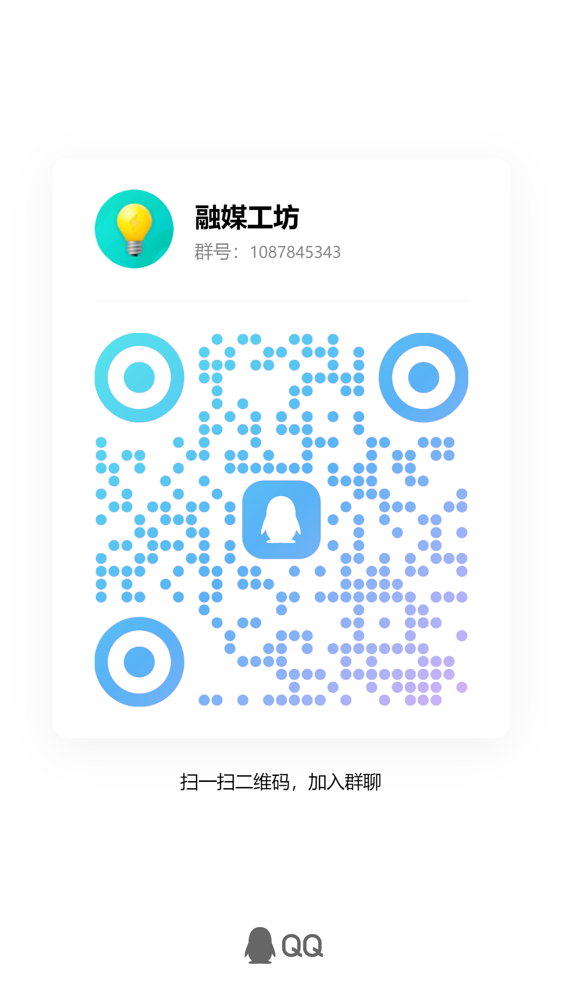

# 融媒工坊

> 融媒工坊 — 部署在本地的六段式媒体运营流水线，从信息采集到多平台分发的全链路自动化工作台。

[](LICENSE)
[](https://nodejs.org)
[](#)
[](CONTRIBUTING.md)

---

## 功能概览

| 阶段 | 能力 | 说明 |
|:---:|---|---|
| 1 | 搜集信息 | 自动抓取官媒10家 + 财经/科技官方TOP10 + 分类站点源（共30+官方源），支持手动粘贴素材。自动添加分类，默认增加本分类国际+国内官方内容 |
| 2 | 整合信息 | 去重、交叉验证、分类打标、重要度排序（0-100评分），生成带来源的热点简报 |
| 3 | 信息分类 | 自动标签（政策/公司/市场/民生/行业趋势）+ 传播性评级（高/中/低）|
| 4 | 内容处理 | 生成可发布文案/口播稿（可接入 DeepSeek，也可用本地模板）|
| 5 | 海报和视频 | 一键生成海报 SVG + 短视频分镜脚本（口播/画面/字幕），支持剪映 / MoneyPrinterTurbo / 即梦 |
| 6 | 分发 | 10平台发布包（抖音/小红书/微博/视频号/B站/快手/YouTube/X/TikTok/Instagram）+ 发布审核 |
| 7 | 本地制作 | 支持本地素材上传，默认内容分析处理，进行内容生产和分发 |

### 核心特性

- **官方信源驱动**：信息源按可信度分 A/B/C 三级，央媒和官方机构为 A 级，要求双源验证，确保权威可溯源
- **内容分级生产**：A类深度分析（时政/财经）、B类精简（娱乐/游戏）、C类热度榜
- **AI 自动流转**：默认 10 秒无人操作自动推进全流程，支持定时扫描（10/20/30/60 分钟）
- **多视频引擎**：内置 CapCut Mate（剪映）+ MoneyPrinterTurbo 双引擎，也支持即梦 AI 成片
- **本地素材上传**：视频/图片素材本地上传，自动转存到对应引擎的素材库
- **工作助手**：跨页面悬浮助手，支持历史对话持久化、一键生成日报/周报/月报/年报
- **免费本地模型**：支持接入 Ollama 免费模型跑全流程文案，无需 API Key
- **苹果浅暖 UI**：遵循 Apple HIG 风格，暖白底 + 暖橙强调色，克制装饰、信息优先

## 快速开始

### 环境要求

- [Node.js](https://nodejs.org) >= 18
- 无需安装任何依赖（纯 Node.js，无 `npm install`）

### 启动

```bash
# 方式一：双击 start.bat（Windows）
# 方式二：命令行启动
node server.mjs
```

浏览器打开 **http://127.0.0.1:3211** 即可使用。

### 一键运行全流程

点击首页底部 Dock 的「一键运行」面板 → 「一键运行全流程」，系统会自动执行采集→整合→分类→汇总→制作→分发全流程。默认 10 秒无修改意见自动推进，也可在定时设置中选择关闭/10/20/30/60 分钟自动扫描。

## 配置

### AI 接入（可选）

在 `config.json` 的 `ai` 字段填写：

```json
{
  "ai": {
    "enabled": true,
    "baseUrl": "https://api.deepseek.com",
    "model": "deepseek-chat",
    "apiKey": "你的KEY"
  }
}
```

也可设置环境变量 `DEEPSEEK_API_KEY`。未配置 AI 时使用本地模板生成文案，功能完整但文风固定。

### 本地免费模型（Ollama）

```bash
winget install -e --id Ollama.Ollama
ollama pull qwen2.5:3b
```

在工作台「+ 添加 → 大模型」填入 `http://localhost:11434/v1`，模型 `qwen2.5:3b`，密钥留空即可。

### 视频引擎

| 引擎 | 地址 | 说明 |
|---|---|---|
| 剪映（CapCut Mate） | `http://127.0.0.1:30000` | 本地剪映草稿自动创建 |
| MoneyPrinterTurbo | `http://127.0.0.1:8080` | 开源短视频一键生成 |
| 即梦 | — | AI 图文成片（无素材时）|

## 项目结构

```
media-operations-platform/
├── config.json              # 行业、来源、平台、AI 配置
├── server.mjs               # 本地服务 + API
├── start.bat                # Windows 快捷启动
├── category_sources.json    # 分类站点源（国际/财经/科技等）
├── scripts/
│   ├── pipeline.mjs         # 六段流水线核心逻辑
│   ├── run-all.mjs          # 命令行一键跑全流程
│   ├── moneyprinter.mjs     # MoneyPrinterTurbo 适配器
│   ├── capcut-bridge.mjs    # 剪映 CapCut Mate 桥接
│   ├── capcut-mate.mjs      # 剪映任务包生成
│   └── selftest.mjs         # 自检脚本
├── public/                  # 操作界面（纯 HTML/CSS/JS）
│   ├── index.html
│   ├── app.js
│   └── styles.css
├── skills/
│   └── wechat-traework-layout/  # 公众号排版技能
├── docs/
│   ├── 工作流说明.md
│   └── 新媒体运营工作流V2-官方信源驱动版.md
├── DESIGN.md                # UI 设计规范（Apple 浅暖风格）
├── AGENTS.md                # AI 开发规则
└── CHANGELOG.md             # 变更记录
```

## 官方信源矩阵

搜集信息：自动抓取官媒10家 + 财经/科技官方TOP10 + 分类站点源（共30+官方源），支持手动粘贴素材。自动添加分类，默认增加本分类国际+国内官方内容。

- **央媒 10 家**：人民日报、新华社、央视新闻、央广网、光明日报、经济日报、中国日报、科技日报、工人日报、中国青年报
- **财经官方 10 家**：央行、财政部、发改委、证监会、统计局、金融监管总局、外汇局、商务部、税务总局、上交所
- **科技官方 10 家**：工信部、科技部、网信办、知识产权局、中科院、工程院、航天局、标准委、科协、能源局

详细流程见 [docs/新媒体运营工作流V2-官方信源驱动版.md](docs/新媒体运营工作流V2-官方信源驱动版.md)。

## 分发平台

内置 10 个分发平台，每平台支持多账号管理：

| 国内 | 海外 |
|---|---|
| 抖音、小红书、微博、视频号、B站、快手 | YouTube、X (Twitter)、TikTok、Instagram |

海外平台已按官方 API 模板内置授权流程，填写对应凭据后即可使用。

## 技术栈

- **后端**：Node.js 原生 HTTP Server（无框架、无构建步骤）
- **前端**：原生 HTML / CSS / JavaScript（无框架、无构建）
- **AI**：DeepSeek API / Ollama 本地模型
- **视频**：CapCut Mate（剪映）/ MoneyPrinterTurbo / 即梦
- **设计**：Apple HIG 浅暖色风格

## 开发

修改 UI 前请先阅读 [DESIGN.md](DESIGN.md) 保持风格一致性，AI 开发规则见 [AGENTS.md](AGENTS.md)。

欢迎贡献代码，详见 [CONTRIBUTING.md](CONTRIBUTING.md)。

## 交流群

欢迎加入融媒工坊 QQ 群，交流使用经验、反馈问题、获取更新通知。

- **QQ 群号**：1087845343
- **扫码加入**：

<p align="center">
  
</p>

## 开源许可

[PolyForm Noncommercial License 1.0.0](LICENSE) © 2026 融媒工坊 Contributors

> 本项目禁止商业用途。个人学习、研究、教育、非营利组织使用均不受限制。
